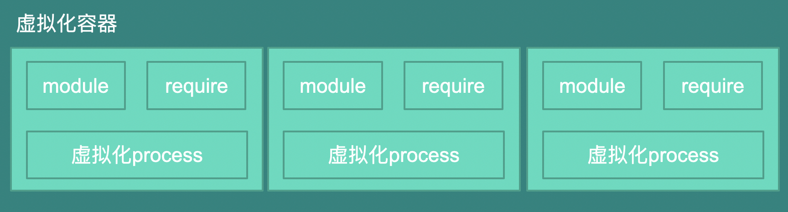
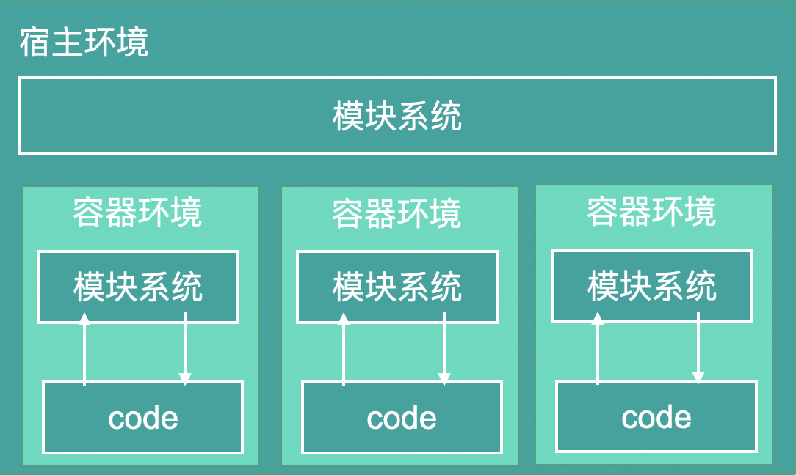
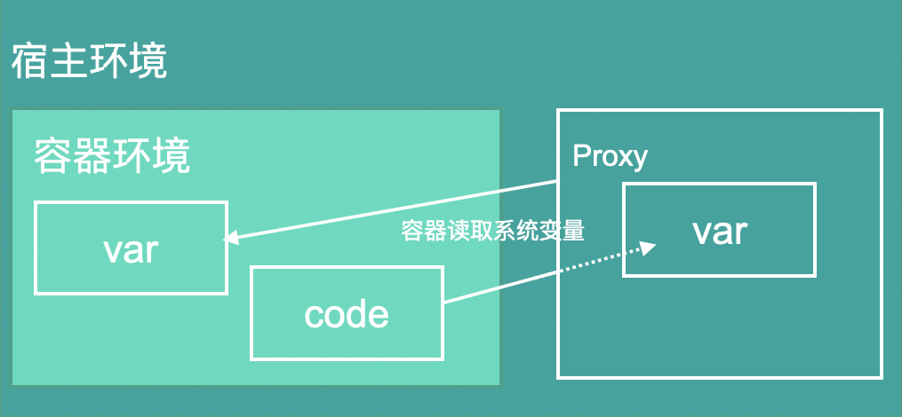
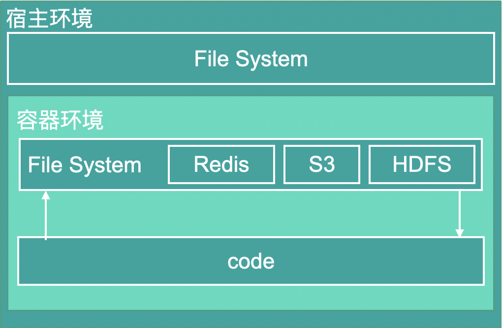
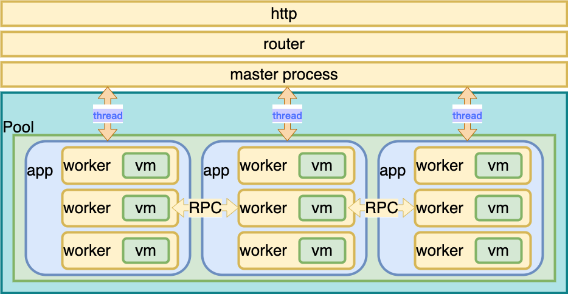
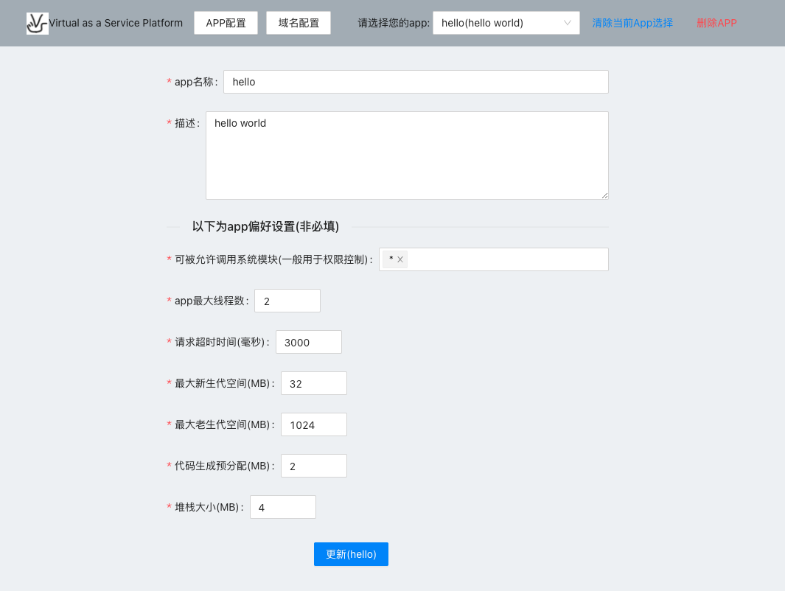
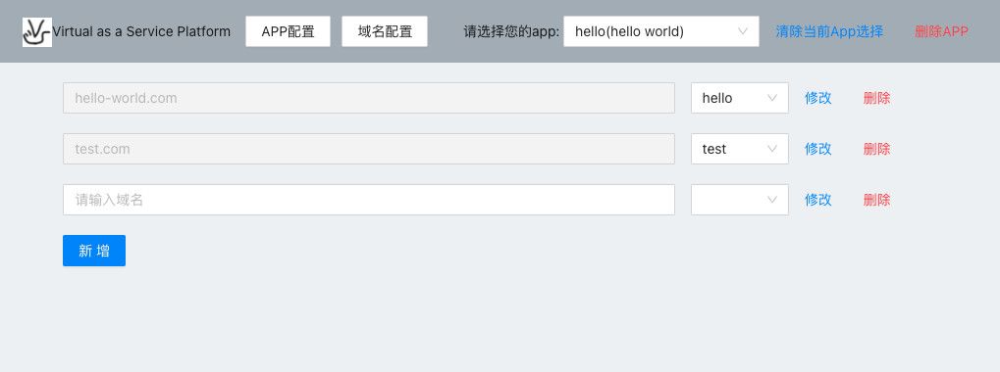
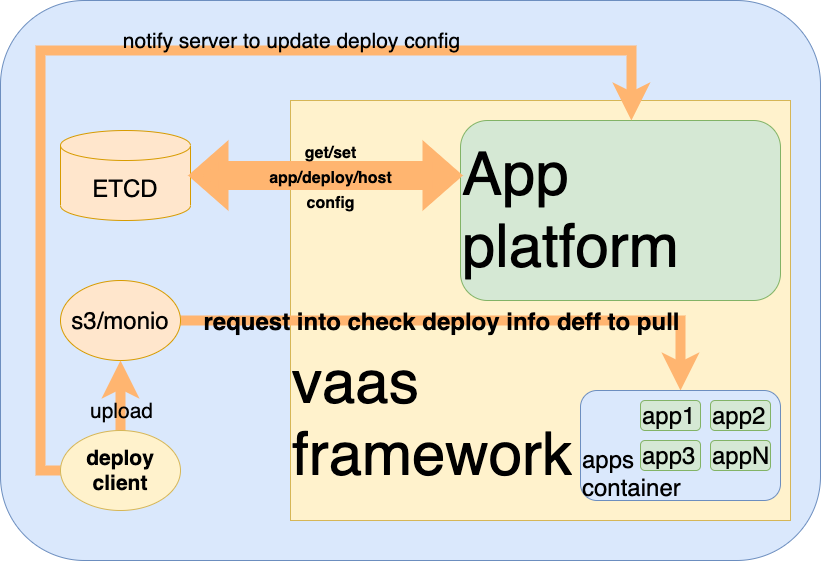

# 虚拟化服务，JS服务架构的未来
由于近两年一直在从事serverless系统的开发，本篇文章算是在未来serverless开发方向的一些心得，对这套开发模式未来的一些走向提供一些自己的所见所想，也基于目前过于传统的serverless的实现在表达不满的同时，自己也重写做了一些实现以及在项目中的一些工程化的实践，得出一些结论和大家共享。当然毕竟一千个人的眼里就有一千个哈姆雷特，所以意见不同请轻喷，感谢。

# 序言
在双逢干涉中，我们有理由怀疑这个世界的真实性。在docker诞生后，我们可以虚拟化当前的环境。那么如果实现一个让代码层面就直接实现虚拟化，是不是有点意思？

# 虚拟化-核心
核心作为实现node.js虚拟化的第一步，我们要有各种欺骗代码的一些技巧。比如为每块代码都提供出对应的容器,而对于容器而言需要虚拟的部分主要在于虚拟module和process以及一个重写过的require。大致结构如下：



虚拟的module的主要作用是打断和宿主module的联系，也就是说在虚拟容器中发生的引用可能对于宿主module来说根本就没有发生过。



虚拟process的目的是让虚拟环境对process的修改只对自己生效，而不会影响到宿主环境的process，即是环境变量方向的一种欺骗。



重写的require目的和虚拟module的区别主要是实现对系统模块或第三方模块或引用路径的重写或权限限制。比如不允许你引用当前目前外的代码，再比如就是重写fs模块，让你读取的文件表明是在服务器而实质是可能是某个分布式数据库中。



源代码传送门: [https://github.com/virtual-less/vaas-core](https://github.com/virtual-less/vaas-core)

# 虚拟化-服务框架
有了核心，我想是时候跟目前传统的微服务架构和函数即服务再见了，首先我们要有更加优雅的实现。
* 是时候跟使用仓库隔离来防止引用说再见了👋 我们可以直接在引用层拦截 ✅
* 是时候跟callback和ctx.body={...}这种丑陋的写法说再见了👋 我们直接用return返回数据，throw抛出异常✅
* 是时候跟中心化路由这种集中化配置导致易发冲突的方式说再见了👋 我们直接用装饰器的中心化路由实现【具体如下个例子】✅

```ts
import {VaasServerType, Decorator } from 'vaas-framework'
export default class Hello {
    @Decorator.VassServer({type:'http',method:'get',routerName:'/hello'})
    async hello({req,res}:VaasServerType.HttpParams) {
        return {
            hello:'world'
        }
    }
}
```
以上是虚拟化服务框架中最简单的代码例子，这里代表了在/hello/hello中能返回{hello:'world'}的结果。其中：
* 每一个变量有拥有其变量提示
* 路由通过装饰器VassServer来配置，同时支持另外两种类型rpc和websocket
* 通过return返回数据，通过throw来抛出Error类型异常

既然作为使用虚拟化框架，也就意味着不同的APP不能相互实现阻塞和相互的影响，所以在架构实现上对于每个App都支持配置多线程数量，且每个多线程中使用vm进行对应的虚拟化工作。同时依托于线程池控制，即可实现多个请求复用worker。而每个App的代码非常巧妙在worker中进行了缓存且被不断的使用，直到长期无请求导致worker过期回收。具体架构如下：


这个架构之下还有一个好处就是不需要过度关心内存泄漏问题，因为单次请求结束且超时时间外没有新连接则默认释放内存，这个模式类似PHP，但是和PHP不同点为不会马上释放，且可以复用多线程的模式。

如果想要体验，可以使用npm的初始化脚本进行体验(系统需要支持git且需要在命令行中翻墙，win系统请谨慎尝试)
```sh
npm init vaas
```
源代码传送门: [https://github.com/virtual-less/vaas-framework](https://github.com/virtual-less/vaas-framework)

# 虚拟化-服务平台
光有框架，我觉得还是远远不够的，所以我决定使用框架作为底层提供出一个为私有企业定制的一套部署平台，也就是说你可以直接在这个平台上部署一些虚拟化的App，同时可以支持直接在平台上实现App相关的配置。也就是说这个服务平台的作用是当框架开发完成若干APP，可以直接使用这个平台来管理APP并实现动态部署，让开发和发布更加简单。同时这个平台也是基于```虚拟化-服务框架```进行开发的一个APP。

目前服务平台使用了ETCD作为配置中心来实现APP配置和部署配置。并实现了配置界面：

App配置主要用于限制对代码的一些权限配置和性能限制，比如不希望代码读文件则可以不添加fs模块权限。如下：


域名配置主要用于当我们需要域名直接打到app时做的一些域名上的配置，这样访问就不需要还带有app路径。如下：


在使用ETCD作为平台配置组件时，中间发生了一个小插曲，在使用ETCD的时候搜索了一圈居然没有支持ETCD3.5以上的npm包😂，所以顺手简单整合封装了一波。

源代码传送门: [https://github.com/zy445566/netcd](https://github.com/zy445566/netcd)

同时使用S3文件服务的完全实现minio来作为代码文件服务的管理，包括我们需要发布一些APP也是执行```vaas deploy``` 命令先上传到minio的服务上，并修改ETCD配置来完成部署。再由平台来通过校验本地代码和对比ETCD的代码地址区别来决定保证第一时间完成部署。具体架构如下：


这个基本是一个最简化的serverless部署平台，实现了前后端，对于想要自己定制的，下面也开放的源码，按照自己企业要求修改即可。

源代码传送门: 

后端: [https://github.com/virtual-less/vaas-platform](https://github.com/virtual-less/vaas-platform)

前端: [https://github.com/virtual-less/vaas-platform-ui](https://github.com/virtual-less/vaas-platform-ui)

# 结语
通过底层的虚拟化，开发层面上框架层，到最后使用层面的平台层，严格来说这其实是代码层面上的serverless的开源实现。但是比目前serveless平台来比较的话，更关注于个人或企业内部的使用，而不是对外开放使用。同时在代码使用方式和开放部署流程上的一些优化与提升。在服务架构上来说未来不一定说一定会朝着虚拟化这个方向前进，但一定会是一个必经之路。


